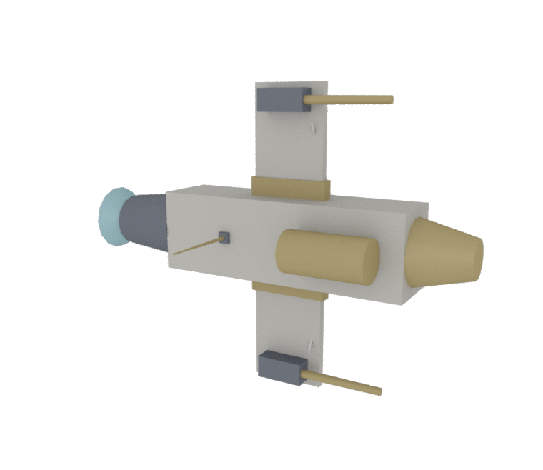
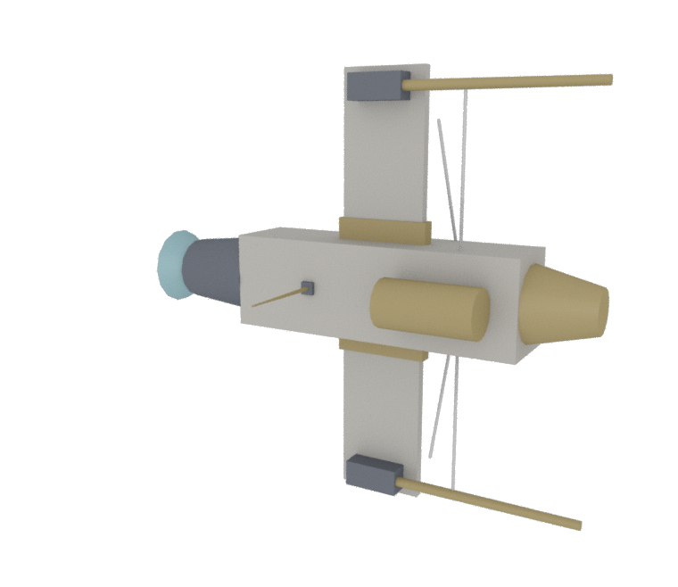
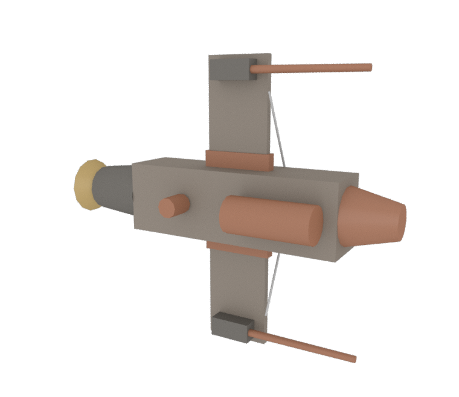
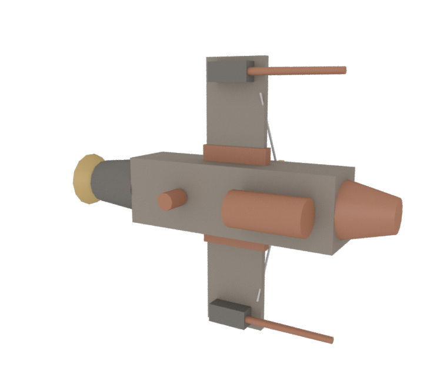
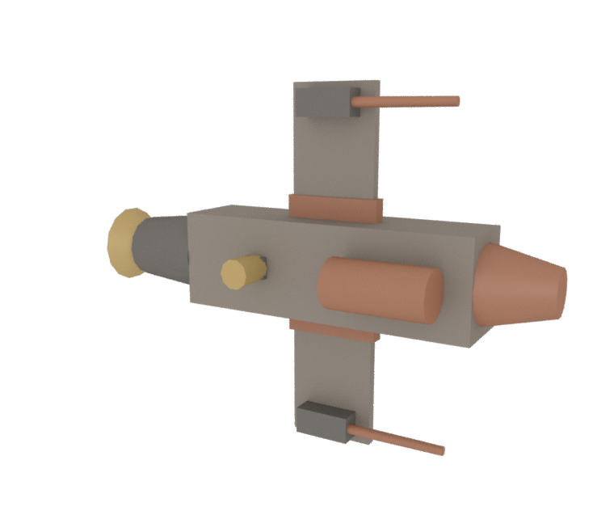

# KITMASH PLATES

*A registry of ships assembled by a machine that kept its reasons.*

> Each plate records a craft that was never drawn, only decided — a sequence of commitments, overloads, and repairs, logged by the assembler as they happened. Nothing in these captions is invented. Every moment, every strain, every spawned strut is read back from the machine’s own ledger.

*after Borges, who catalogued the animals that belong to the Emperor.*

---

## PLATE XLVII — GS-α  «Lawful Mean»

*High Guild · era 812 · “Lawful Mean”*

Struck from seed 7 in the High Guild yards, in the 812ᵗʰ era. Its spine is a core_hull. Twice the cannon overran its cap at the wing R and the wing L joints (29,545 against 20,000); each time a strut answered, settling the load to 11,597 — a 61% relief. The sensor pod refused a clean seat (strain 0.109); a collar was spawned to seat it. Fuel runs from the fuel tank to the engine in 4 hops. In the end: 10 parts, 9,464 units of mass, 3 spawned struts, 1 hose run.

---

## PLATE XLVIII — GS-β  «Heavier Daughter»

*High Guild · era 812 · “Heavier Daughter”*

Struck from seed 7 in the High Guild yards, in the 812ᵗʰ era. Its spine is a core_hull. Bred from GS-α by heavy 1.0→1.7, span 3.0→3.9. Twice the cannon overran its cap at the cannon joint (80,800 against 32,500); each time a strut answered, settling the load to 12,120 — an 85% relief. Twice the cannon overran its cap at the wing R and the wing L joints (82,415 against 20,000); each time a strut answered, settling the load to 16,729 — an 80% relief. Fuel runs from the fuel tank to the engine in 4 hops. In the end: 8 parts, 10,971 units of mass, 6 spawned struts, 1 hose run.

---

## PLATE XLIX — FV-γ  «Tape Holds»

*Feral · era 977 · “Tape Holds”*

Struck from seed 23 in the Feral yards, in the 977ᵗʰ era. Its spine is a core_hull. Twice the cannon overran its cap at the wing R and the wing L joints (56,406 against 36,363); each time a strut answered, settling the load to 23,859 — a 58% relief. The sensor pod refused a clean seat (strain 0.090); a collar was spawned to seat it. The sensor pod refused a clean seat (strain 0.092); a collar was spawned to seat it. Fuel runs from the fuel tank to the engine in 4 hops. In the end: 10 parts, 10,604 units of mass, 4 spawned struts, 1 hose run.

---

## PLATE L — FV-δ  «Cold Shoulder»

*Feral · era 977 · “Cold Shoulder”*

Struck from seed 41 in the Feral yards, in the 977ᵗʰ era. Its spine is a core_hull. Bred from FV-γ by +radiator gene, wants reshuffled. Twice the cannon overran its cap at the wing R and the wing L joints (41,860 against 36,363); each time a strut answered, settling the load to 17,107 — a 59% relief. The sensor pod refused a clean seat (strain 0.001); a collar was spawned to seat it. Fuel runs from the fuel tank to the engine in 4 hops. In the end: 9 parts, 10,139 units of mass, 3 spawned struts, 1 hose run.

---

## PLATE LI — FV-ε  «Loom»

*Feral · era 977 · “Loom”*

Struck from seed 101 in the Feral yards, in the 977ᵗʰ era. Its spine is a core_hull. Bred from FV-γ by +reactor/turret genes, electrified. When the turret loaded the turret joint, its moment rose to 2,045 against a cap of 1,818; a strut was spawned, and the load fell to 1,329 — a 35% relief. When the turret loaded the turret joint again, its moment rose to 1,932 against a cap of 1,818; a strut was spawned, and the load fell to 1,256 — a 35% relief. Fuel runs from the fuel tank to the engine in 4 hops. Fuel runs from the reactor to the turret in 1 hop across 1 leap. Fuel runs from the reactor to the turret in 2 hops across 2 leaps. In the end: 10 parts, 10,031 units of mass, 2 spawned struts, 3 hose runs.

---
